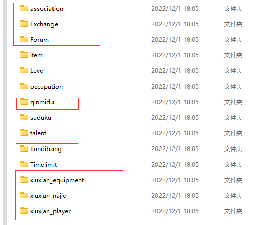

# 绝云间修仙2.0.0 【荒芜异界，仙鼎至尊】
## 玩家攻略：
[修仙攻略](https://docs.qq.com/doc/DSUhqZWdpZXJuUndZ?&u=4bd0757f64094c48b02d7cfc4eaeb44b)  
## 访问量：        
<br> <br>       
## 安装      

> Yunzai-Bot/目录下执行  
```
git clone  https://gitee.com/xialuo03/xiuxian-emulator-plugin.git ./plugins/xiuxian-emulator-plugin/

```         
> 如需从原插件更改至本插件，可在Yunzai-Bot/plugins/xiuxian-emulator-plugin/目录下执行
```
git remote set-url master https://gitee.com/xialuo03/xiuxian-emulator-plugin.git
```
```
git fetch

```
## 转移存档            
     
存档位置  
```
\Yunzai-Bot\plugins\xiuxian-emulator-plugin\resources\data
```      
若要转移存档，将上面画框的文件保存，将修仙插件删除，执行上面安装命令，将上面画框的文件替换到对应文件,然后执行【#一键同步】               
## 更新完后一定要发【#一键同步】，不要偷懒直接保存data文件夹
## 更新内容
要获取最新更新内容发"#查看日志"即可查看
## 配置与存档   
>xiuxian-emulator-plugin/ config / xiuxian / xiuxian.yaml       
>xiuxian-emulator-plugin/ resources / data          
>可根据需求自行修改     
## 免责声明       
1. 功能仅限内部交流与小范围使用       
2. 请勿用于任何以盈利为目的的场景     
## 原作者信息
原插件：[@ningmengchongshui](https://gitee.com/ningmengchongshui)  
原作者：[@DDZS](https://gitee.com/hutao222)

有问题可反馈issues。